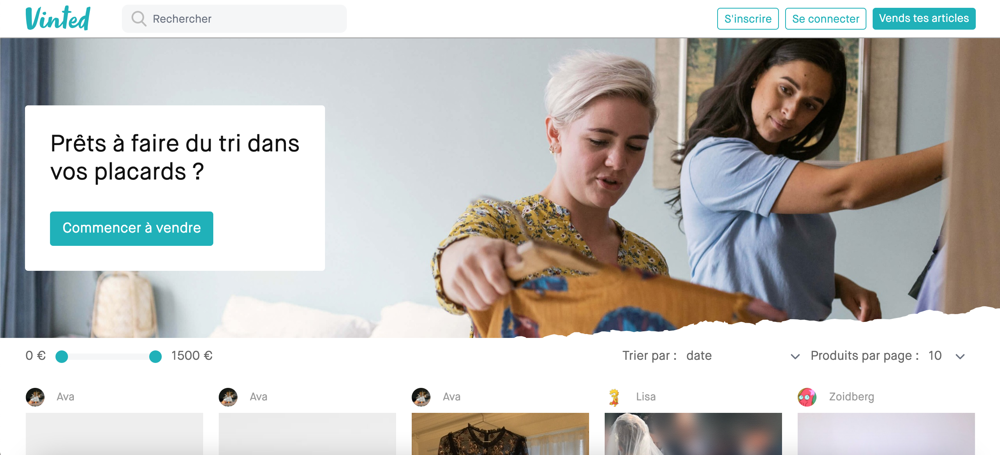

# VINTED FRONT END 👗🔁💰

_Copy of the used clothing sales site Vinted._



<br/>
[See the project](https://vini-vidi-vinted.netlify.app/)

## Installation

1. Clone the repo

2. Install NPM packages

   ```sh
   yarn
   ```

3. Run the project

   ```JS
   yarn start
   ```

4. Enjoy 🎇
   ```JS
   http://localhost:3000/
   ```
